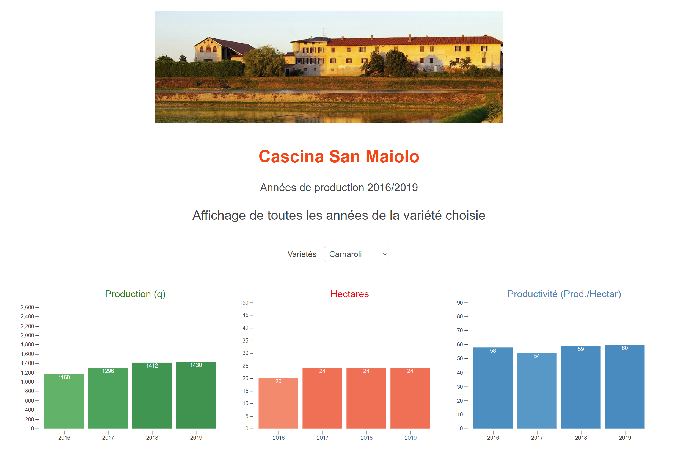
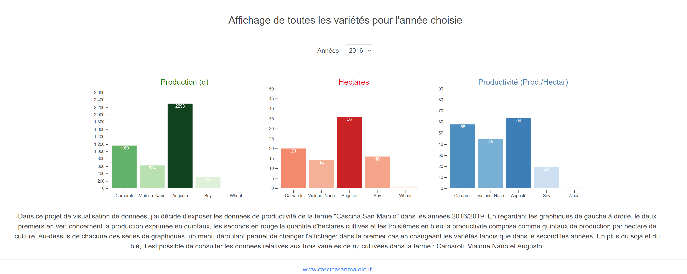

# 2016 - 2019 visualization of cereal production 
### The document uses the d3 library to present the visualization of the data relating to the cereal production in the "Cascina San Maiolo" farm between the years 2016 and 2019.
### [Clik here to see the document](https://francesco-tromellini.github.io/Projet-D3-CSM_2/)
## The project
This data visualization project was developed as part of the "Visaulisations des données" course at the University of Lausanne (UNIL) held by professors Isaac Pante and Loïc Cattani.
The aim is to create a clear and interactive visualization of the cerial production of the farmhouse so that it is possible read the hectares, the production, and the productivity index at a glance.
## The visualization
The visualization is mainly divided into two parts which show the same data in different ways. The first part allows you to view hectares, production and productivity (production per hectare) of all the years according to the variety selected with the drop-down menu.

*View of the first part of the visualization*
The second part shows the same data but divides them by variety and allows you to select the year with the drop-down menu.

*View of the second part of the visualization*
## Packages
* [BootStrap](https://getbootstrap.com/)
* [D3](https://d3js.org/)
